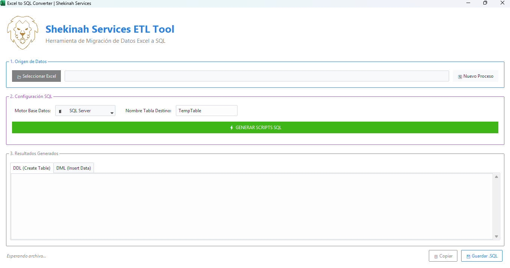

# 🚀 Shekinah ETL: Universal Excel to SQL Converter

<div align="center">
  
  <br><br>
  
  
  
  
  
</div>

<br>

**Shekinah ETL** es una herramienta de escritorio de alto rendimiento diseñada para la ingeniería y migración de datos. Transforma hojas de cálculo de Excel (`.xlsx`) en scripts SQL listos para producción, automatizando la detección de tipos de datos y la limpieza de valores nulos.

Diseñada para desarrolladores y analistas que necesitan migrar datos masivos sin errores de formato.

---

## 📸 Interfaz de Usuario


*(Interfaz moderna con soporte para modo oscuro/claro y logs en tiempo real)*


---

## ⚡ Características Principales

### 🧠 Motor de Inferencia Inteligente
* **Detección de Tipos Híbrida:** A diferencia de las herramientas tradicionales, Shekinah ETL escanea la columna completa. Si detecta **un solo valor de texto** en una columna numérica, promueve automáticamente toda la columna a `VARCHAR` para evitar errores de inserción.
* **Sanitización de Datos (Data Cleansing):**
    * Convierte automáticamente `NaN`, `NaT`, `inf` y celdas vacías en `NULL` nativo de SQL.
    * Escapa caracteres peligrosos (como comillas simples `'`) para prevenir errores de sintaxis o inyecciones SQL.

### 🛢️ Soporte Multi-Motor Universal
Genera sintaxis DDL y DML nativa y optimizada para:

| Motor | Característica Especial |
| :--- | :--- |
|  **SQL Server** | Soporte para Tablas Temporales Locales (`#Tabla`) y tipos `NVARCHAR`. |
|  **Oracle** | Manejo avanzado de fechas con `TO_DATE` y `GLOBAL TEMPORARY TABLES`. |
|  **MySQL** | Sintaxis compatible para `TEMPORARY TABLE`. |
|  **PostgreSQL** | Soporte para `TEMP TABLE` estándar. |
|  **SQLite** | Tipado dinámico (`TEXT`, `INTEGER`, `REAL`) compatible con móviles. |

### 🎨 Experiencia de Usuario (UX) Premium
* **Non-Blocking UI:** Arquitectura basada en **Threading** (Hilos) que mantiene la interfaz fluida incluso procesando archivos de miles de filas.
* **Integración con Windows:** Identidad de aplicación propia (AppUserModelID) para mostrar el logo correcto en la barra de tareas.
* **Validaciones Robustas:** Impide la pérdida de datos accidentales mediante alertas modales y validaciones de flujo.

---

## 🛠️ Instalación y Uso

### Prerrequisitos
* Python 3.8 o superior.

### Pasos

1.  **Clonar el repositorio:**
    ```bash
    git clone [https://github.com/TU_USUARIO/Shekinah-ETL-Converter.git](https://github.com/TU_USUARIO/Shekinah-ETL-Converter.git)
    cd Shekinah-ETL-Converter
    ```

2.  **Instalar dependencias:**
    ```bash
    pip install -r requirements.txt
    ```

3.  **Ejecutar la aplicación:**
    ```bash
    python app.py
    ```

---

## 📦 Estructura del Proyecto

```text
Shekinah-ETL/
│
├── assets/                 # Recursos gráficos
│   └── screenshot.png      # Captura de pantalla para el README
├── shekinah_logo.png       # Logo principal
├── icono.ico               # Icono de ventana
├── app.py                  # Código fuente principal
├── requirements.txt        # Dependencias (pandas, ttkbootstrap, etc.)
└── README.md               # Documentación